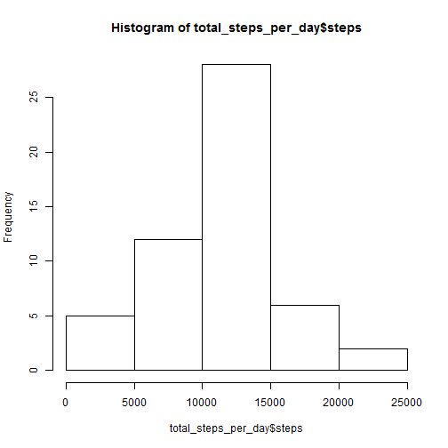
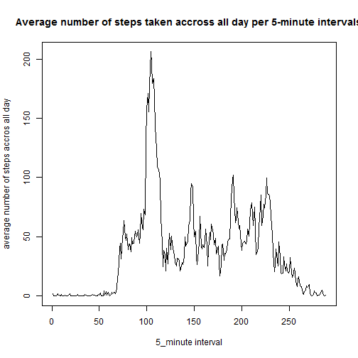
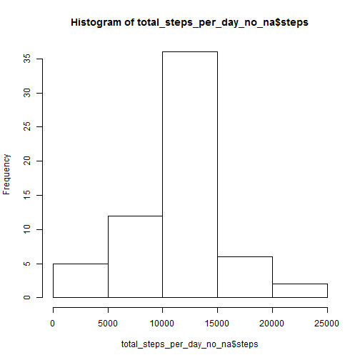
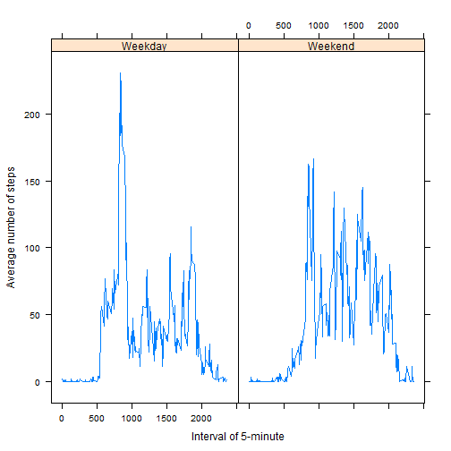

##Loading and preprocessing the data

At first we loaded packages needed for futher data analysis.


```r
library(lattice)
library(data.table)
```

And we define the path to data.


```r
PATH="D:/01Coursera/Specializace/DataScience/Course5-Reproducible Research/PeerAssignment1/"
```

And we can load the data.


```r
setwd(PATH)
data = fread('activity.csv',header=TRUE,stringsAsFactors = F)
summary(data)
```

```
##      steps            date              interval     
##  Min.   :  0.00   Length:17568       Min.   :   0.0  
##  1st Qu.:  0.00   Class :character   1st Qu.: 588.8  
##  Median :  0.00   Mode  :character   Median :1177.5  
##  Mean   : 37.38                      Mean   :1177.5  
##  3rd Qu.: 12.00                      3rd Qu.:1766.2  
##  Max.   :806.00                      Max.   :2355.0  
##  NA's   :2304
```

We can now chech the format of the data and transformed if needed.


```r
class(data)
```

```
## [1] "data.table" "data.frame"
```

```r
data <- as.data.frame(data)
```

##What is mean and total number of steps taken per day?
 For this part of the assignement, missing values are ignored.
 
 At first I am going to calculate the total number of steps taken per day.


```r
total_steps_per_day<-aggregate(steps ~ date, data, sum,na.rm=TRUE)
head(total_steps_per_day)
```

```
##         date steps
## 1 2012-10-02   126
## 2 2012-10-03 11352
## 3 2012-10-04 12116
## 4 2012-10-05 13294
## 5 2012-10-06 15420
## 6 2012-10-07 11015
```

To see the most frequent count of steps we can use histogram. 


```r
hist(total_steps_per_day$steps)
```

 

Finaly, mean and median of the total number of steps taken per day is calculated.

```r
mean_steps_per_day<-aggregate(steps ~ date, data, mean,na.rm=TRUE)
head(mean_steps_per_day)
```

```
##         date    steps
## 1 2012-10-02  0.43750
## 2 2012-10-03 39.41667
## 3 2012-10-04 42.06944
## 4 2012-10-05 46.15972
## 5 2012-10-06 53.54167
## 6 2012-10-07 38.24653
```

```r
median_steps_per_day<-aggregate(steps ~ date, data, median,na.rm=TRUE)
head(median_steps_per_day)
```

```
##         date steps
## 1 2012-10-02     0
## 2 2012-10-03     0
## 3 2012-10-04     0
## 4 2012-10-05     0
## 5 2012-10-06     0
## 6 2012-10-07     0
```

##What is the average daily activity pattern?

Now I make a time series plot of the 5-minute interval (x-axis) and the average number of steps taken, averaged across all days (y-axis).

```r
time_series <- tapply(data$steps, data$interval, mean, na.rm = TRUE)
plot(time_series, type = "l",xlab="5_minute interval",ylab="average number of steps accros all day",main="Average number of steps taken accross all day per 5-minute intervals")
```

 

It should be nice to know in which interval the guy is the most productive across all days.

```r
max_interval <- which.max(time_series)
names(max_interval)
```

```
## [1] "835"
```

##Imputing missing values
Missing values can bias the report. I will thus calculate total number of NA's in data.


```r
count_NA <- sum(is.na(data))
count_NA 
```

```
## [1] 2304
```
I will try to fill the NA's with replacing the average of 5-minute interval.


```r
five_minute_mean <- aggregate(steps ~ interval, data = data, FUN = mean)

data_no_na<-data
for (i in 1:nrow(data_no_na)) {
      st<-data_no_na[i,]
      if (is.na(st$steps)) {
        krok <- subset(five_minute_mean, interval == st$interval)$steps
    } else {
        krok <- st$steps
    }
     data_no_na[i,]$steps<-krok 
     }

count_NA <- sum(is.na(data_no_na))
count_NA 
```

```
## [1] 0
```

The histogram, mean and median are depict again to show the differences between data with NA's and without NA's.


```r
total_steps_per_day_no_na<-aggregate(steps ~ date, data_no_na, sum,na.rm=TRUE)
hist(total_steps_per_day_no_na$steps)
```

 

```r
mean_steps_per_day_no_na<-aggregate(steps ~ date, data_no_na, mean,na.rm=TRUE)
head(mean_steps_per_day_no_na)
```

```
##         date    steps
## 1 2012-10-01 37.38260
## 2 2012-10-02  0.43750
## 3 2012-10-03 39.41667
## 4 2012-10-04 42.06944
## 5 2012-10-05 46.15972
## 6 2012-10-06 53.54167
```

```r
median_steps_per_day_no_na<-aggregate(steps ~ date, data_no_na, median,na.rm=TRUE)
head(median_steps_per_day_no_na)
```

```
##         date    steps
## 1 2012-10-01 34.11321
## 2 2012-10-02  0.00000
## 3 2012-10-03  0.00000
## 4 2012-10-04  0.00000
## 5 2012-10-05  0.00000
## 6 2012-10-06  0.00000
```
You can see that the results changed. Filling missing values help us that we have calculation for all months. 

##Are the differences in activity patterns between weekdays and weekends?
Dataset with no NA's values are used for this report. 

First, it is needed to create new factor variable with two levels - weekday and weekend indicating whether a given date is a weekday or weekend day.


```r
data_no_na$day <- weekdays(as.Date(data_no_na$date))
data_no_na$week<-"na"

for (i in 1:nrow(data_no_na)) {
    if (data_no_na[i,]$day == "sobota") {
        data_no_na[i,]$week <- "Weekend"
    } else if (data_no_na[i,]$day == "nedìle") {
        data_no_na[i,]$week <- "Weekend"
    } else {
        data_no_na[i,]$week <- "Weekday"
    }
}
```

And finaly a time series plot of the average number of steps taken, averaged across all weekday days or weekend days through 5-minute intervals is done. 


```r
averageweek <- aggregate(steps ~ interval + week, data = data_no_na, mean)

xyplot(steps ~ interval | week, averageweek, type = "l", layout = c(2, 1),xlab = "Interval of 5-minute", ylab = "Average number of steps")
```

 
